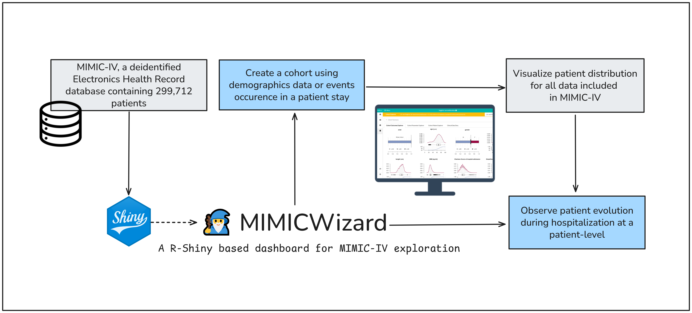

# 🧙 MIMICWizard

**MIMICWizard** is an open-source web application that enables intuitive exploration of the [MIMIC-IV](https://physionet.org/content/mimiciv/) critical care database by clinicians and researchers without programming expertise

 

> [!NOTE] 
> When using this resource, please cite the associated article : (submitted, waiting for review)

## 🧭 Introduction

Large public EHR datasets like MIMIC-IV contain rich, longitudinal patient data but are difficult to navigate for users lacking data science training.

MIMICWizard addresses this gap by providing an interactive dashboard for patient-level data visualization, cohort query and creation, statistical summarization for MIMIC-IV database.

Originally developed for clinicians, MIMICWizard supports hypothesis generation and data exploration in a hospital context.

## 🚀 Features

-   Visual exploration of patient data from MIMIC-IV.
-   Cohort creation and exploration for hypothesis generation
-   Stratification and descriptive statistics on population and subgroups
-   Advanced exploration with search engine including events, ICD and demographics
-   Demo mode with a lightweight dataset.
-   Open-source and community-driven.

## 🖥 Demo

A demo version of the application is available at [https://mimicwizard-demo.lcr.datailor.eu/](https://mimicwizard-demo.lcr.datailor.eu/).

This demo version use [MIMIC-IV demo database](https://physionet.org/content/mimic-iv-demo/2.2/), an openly-available demo of MIMIC-IV containing a subset of 100 patients.

## 🛠 Installation and usage

MIMICWizard is based on R Shiny and interact with a PostgreSQL database. Detailed setup instruction are available on the [dedicated documentation page](https://mimicwizard.readthedocs.io/en/latest/installation/).

More information about the application and usage are available on the [ReadTheDocs documentation](https://mimicwizard.readthedocs.io/en/latest/).

> [!IMPORTANT] 
> Access to the full MIMIC-IV dataset requires credentialing and completion of a data use agreement. Visit [PhysioNet](https://physionet.org) for more information.

### 📦 Changelog

**v0.7.1** (2025-06-27) Bugfixes and optimization

**v0.7.0** (2025-06-20) Public release associated with online demo version

**v0.6.4** (2025-03-13) First closed full version beta-testing

## 🧪 Research & Development

This application was developed by the **Laboratoire Commun de Recherche - HCL-bioMérieux** (Lyon, France), a joint research initiative between Edouard Herriot Hospital and bioMérieux.

📫 For questions, suggestions, or collaborations, feel free to open an issue or contact the research team via the GitHub repository.

> [!WARNING] 
> This is not an official product of bioMérieux or Hospices Civils de Lyon. The software is provided "as is" without warranty under GPLv3 license.

### 🤝 Contributing

We welcome contributions from the community! To contribute:

1.  Open a issue about your concerns, problems or feature proposal
2.  Fork the repository and open a Pull Request with your code suggestion
